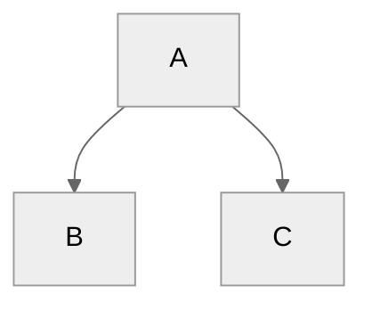

{: .label .label-red }
[to be deleted]

{: .attention }
> Once you are familiar with the available UI components of this template, exclude this page by changing `nav_order: 99` to `nav_exclude: true` on top of this page (line 3). Its *front matter* will then look like this:
> ```
> ---
> title: UI Components
> nav_exclude: true
> nav_order: 99
> ---
> ```

# UI Components

The [Just the Docs documentation](https://just-the-docs.github.io/just-the-docs/docs/ui-components) details all available UI components.

A few components you might find useful:

## Labels

{: .label }
[Default label]

{: .label .label-green }
[Green label]

{: .label .label-red }
[Red label]

## Images

```markdown

```


# Custom UI Components

The following customized components have been defined in file `📄_config.yml`.


## Callouts

{: .info }
> This is an info callout.

{: .tip }
> This is a tip callout.

{: .attention }
> This is an attention callout.

{: .download }
> This is a download callout.

## Mermaid.js



Visit the [Mermaid docs](https://mermaid.js.org/intro/) for a thorough description of the charting possibilities.